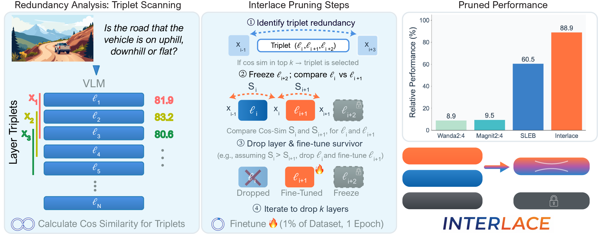

# ✂️ INTERLACE: Interleaved Layer Pruning and Efficient Adaptation in Large Vision-Language Models

<p align="center">
  <a href="https://arxiv.org/abs/2511.19676"></a>
  <a href="https://pmadinei.github.io/Interlace"></a>
  <a href="https://huggingface.co/collections/pmadinei/interlace-69dead3ef6ff07d0dededebc"></a>
  <a href="https://github.com/pmadinei/Interlace/blob/main/Poster%20(CVPRF2026).png"></a>
  <a href="LICENSE"></a>
  
  
  
</p>

<p align="center">
  <b>Parsa Madinei, Ryan Solgi, Ziqi Wen, Jonathan Skaza, Miguel Eckstein, Ramtin Pedarsani</b><br>
  UC Santa Barbara
</p>

> **INTERLACE** is a novel framework that prunes redundant layers in Vision-Language Models (VLMs) while maintaining performance through sample-efficient finetuning. By analyzing triplets of consecutive layers to identify local redundancy, INTERLACE achieves **88.9% average performance retention** after dropping **25% of layers**, outperforming alternative pruning methods by **28.4%**.

## 📊 Key Results

| Method | Sparsity | Fine-Tune | TTFT Speedup | Avg Performance | Relative Perf. |
|--------|----------|-----------|-------------|-----------------|----------------|
| Dense | 0% | No | 1.00x | 77.8% | 97.1% |
| Dense-FT | 0% | Yes | 1.00x | 80.5% | 100.0% |
| Wanda 2:4 | 50% | No | 0.97x | 7.2% | 8.9% |
| SLEB | 25% | No | 1.12x | 48.6% | 60.5% |
| SLEB-FT | 25% | Yes | 1.12x | 46.0% | 57.1% |
| **INTERLACE (Ours)** | **25%** | **Yes** | **1.18x** | **71.6%** | **88.9%** |

## 🔬 Method Overview

INTERLACE operates in three stages:

1. **Triplet-Based Layer Importance**: Analyze groups of three consecutive layers to identify local redundancy patterns using cosine similarity of hidden states.
2. **Strategic Layer Assignment**: Within each selected triplet, drop the most redundant of the first two layers, fine-tune the other, and freeze the third as a stable anchor.
3. **Sample-Efficient Fine-Tuning**: Train only the selected layers on just 1% of the FineVision dataset for a single epoch.

<p align="center">
  
</p>

## 📁 Repository Structure

```
INTERLACE/
├── README.md
├── requirements.txt
├── dataset_sample_counts.json       # Per-subset sample counts for FineVision
├── configs/
│   ├── zero3.json                   # DeepSpeed ZeRO-3 config
│   └── zero3_offload.json           # DeepSpeed ZeRO-3 with CPU offload
├── scripts/
│   ├── prepare_dataset.sh           # Step 1: Prepare FineVision data
│   ├── get_hidden_states.sh         # Step 2: Compute layer similarities
│   └── train_interlace.sh           # Step 3: Train with INTERLACE pruning
├── src/
│   ├── dataset_prep.py              # FineVision dataset preparation
│   ├── dataset_prep_domain.py       # Domain-specific dataset preparation
│   ├── get_hidden_states.py         # Hidden state similarity computation
│   ├── data/
│   │   ├── __init__.py              # Dataset registry
│   │   ├── data_processor.py        # Training data pipeline
│   │   └── rope2d.py                # 2D/3D RoPE position encoding
│   └── train/
│       ├── __init__.py
│       ├── argument.py              # Training & INTERLACE arguments
│       ├── trainer.py               # Custom attention & optimizer patches
│       └── train_interlace.py       # Unified training script
├── eval/
│   ├── README.md                    # Evaluation instructions
│   └── vlmevalkit_config.py         # VLMEvalKit model registration
└── docs/
    └── index.html                   # Project webpage (GitHub Pages)
```

## ⚙️ Installation

```bash
git clone https://github.com/pmadinei/Interlace.git
cd Interlace
pip install -r requirements.txt
```

### Requirements
- Python >= 3.10
- PyTorch >= 2.1.0
- CUDA >= 12.1
- GPU with >= 48GB VRAM (80GB+ recommended for 8B models)

## 🚀 Quick Start

### Step 1: Prepare the Dataset

Download and process a subset of FineVision:

```bash
bash scripts/prepare_dataset.sh ./data 0.01
```

This downloads 1% of FineVision (~240K samples) and saves images and annotations to `./data/`.

For domain-specific experiments:

```bash
python src/dataset_prep_domain.py \
    --dataset ChartQA \
    --output_dir ./data/chartqa
```

### Step 2: Compute Hidden State Similarities

Compute cosine similarity scores for pack sizes 1, 2, and 3:

```bash
bash scripts/get_hidden_states.sh \
    Qwen/Qwen3-VL-8B-Instruct \
    ./data/FineVision_01.json \
    ./hidden_states \
    0.1
```

This produces three JSON files in `./hidden_states/` containing per-layer similarity scores used by the INTERLACE selection algorithm.

### Step 3: Train with INTERLACE

Edit `scripts/train_interlace.sh` to set your paths, then:

```bash
bash scripts/train_interlace.sh
```

Or run directly with custom arguments:

```bash
torchrun --nproc_per_node=1 src/train/train_interlace.py \
    --deepspeed configs/zero3.json \
    --model_name_or_path Qwen/Qwen3-VL-8B-Instruct \
    --dataset_use /path/to/FineVision_01.json \
    --data_flatten True \
    --bf16 \
    --output_dir ./checkpoints/interlace_8b_25pc \
    --num_train_epochs 1 \
    --per_device_train_batch_size 16 \
    --gradient_accumulation_steps 2 \
    --learning_rate 1e-5 \
    --warmup_ratio 0.03 \
    --lr_scheduler_type cosine \
    --gradient_checkpointing True \
    --model_max_length 8192 \
    --pruning_strategy interlace \
    --drop_ratio 0.25 \
    --hs_pack1_path ./hidden_states/Qwen3-VL-8B-Instruct_FineVision_01_pack1_hidden_state_similarities.json \
    --hs_pack2_path ./hidden_states/Qwen3-VL-8B-Instruct_FineVision_01_pack2_hidden_state_similarities.json \
    --hs_pack3_path ./hidden_states/Qwen3-VL-8B-Instruct_FineVision_01_pack3_hidden_state_similarities.json
```

### Step 4: Evaluate

We use [VLMEvalKit](https://github.com/open-compass/VLMEvalKit) for evaluation. See [`eval/README.md`](eval/README.md) for setup instructions.

```bash
python -m vlmeval.run --model Interlace-8B-25pc \
    --data AI2D_TEST ChartQA_TEST OCRBench TextVQA_VAL \
    MMBench_DEV_EN_V11 POPE RealWorldQA \
    HRBench4K HRBench8K VStar MIABench ScienceQA_TEST
```

## 🧪 Pruning Strategies

The unified training script supports multiple layer selection strategies via `--pruning_strategy`:

| Strategy | Description |
|----------|-------------|
| `interlace` | **Full INTERLACE** — Triplet-based selection with individual layer analysis and frozen anchors |
| `interlace_oa` | **Ordered Assignment** — Triplet selection without individual layer analysis (always drops first, tunes second) |
| `interlace_tn` | **Train-Next** — Individual layer similarities only; drops most redundant, tunes adjacent |
| `random` | **Random** — Randomly selects layers to drop and fine-tune |
| `consecutive` | **Consecutive** — Drops a contiguous block of the most redundant layers |

## 🤗 Pretrained Models

All INTERLACE pruned models are available on [🤗 HuggingFace](https://huggingface.co/collections/pmadinei/interlace-69dead3ef6ff07d0dededebc):

| Model | Drop Ratio | Avg Relative Perf. | Link |
|-------|-----------|--------------------|----|
| Interlace-Qwen3-VL-8B-10pc | 10% | 94.0% | [HuggingFace](https://huggingface.co/pmadinei/Interlace-Qwen3-VL-8B-10pc) |
| Interlace-Qwen3-VL-8B-15pc | 15% | 92.1% | [HuggingFace](https://huggingface.co/pmadinei/Interlace-Qwen3-VL-8B-15pc) |
| Interlace-Qwen3-VL-8B-20pc | 20% | 86.9% | [HuggingFace](https://huggingface.co/pmadinei/Interlace-Qwen3-VL-8B-20pc) |
| Interlace-Qwen3-VL-8B-25pc | 25% | 86.1% | [HuggingFace](https://huggingface.co/pmadinei/Interlace-Qwen3-VL-8B-25pc) |
| Interlace-Qwen3-VL-4B-10pc | 10% | 93.9% | [HuggingFace](https://huggingface.co/pmadinei/Interlace-Qwen3-VL-4B-10pc) |
| Interlace-Qwen3-VL-4B-15pc | 15% | 91.9% | [HuggingFace](https://huggingface.co/pmadinei/Interlace-Qwen3-VL-4B-15pc) |
| Interlace-Qwen3-VL-4B-20pc | 20% | 88.0% | [HuggingFace](https://huggingface.co/pmadinei/Interlace-Qwen3-VL-4B-20pc) |
| Interlace-Qwen3-VL-4B-25pc | 25% | 81.7% | [HuggingFace](https://huggingface.co/pmadinei/Interlace-Qwen3-VL-4B-25pc) |

## 🛠️ Training Hyperparameters

| Parameter | Value |
|-----------|-------|
| Optimizer | AdamW |
| Learning Rate | 1e-5 |
| LR Schedule | Cosine with 3% warmup |
| Batch Size | 16 (x2 gradient accumulation = 32 effective) |
| Epochs | 1 |
| Weight Decay | 0 |
| Max Grad Norm | 1.0 |
| Precision | bfloat16 |
| DeepSpeed | ZeRO Stage 3 |
| Training Data | 1% of FineVision (~240K samples) |

## 📝 Citation

```bibtex
@inproceedings{madinei2026interlace,
  title={INTERLACE: Interleaved Layer Pruning and Efficient Adaptation in Large Vision-Language Models},
  author={Madinei, Parsa and Solgi, Ryan and Wen, Ziqi and Skaza, Jonathan and Eckstein, Miguel and Pedarsani, Ramtin},
  booktitle={Proceedings of the IEEE/CVF Conference on Computer Vision and Pattern Recognition (CVPRF)},
  year={2026}
}
```

## 🙏 Acknowledgment

This study was supported by the Institute for Collaborative Biotechnologies (ICB) cooperative agreement W911NF-19-2-0026. The views and conclusions contained in this document are those of the authors and should not be interpreted as representing the official policies of the US Government.

## 📄 License

This project is licensed under the Apache License 2.0. See [LICENSE](LICENSE) for details.
